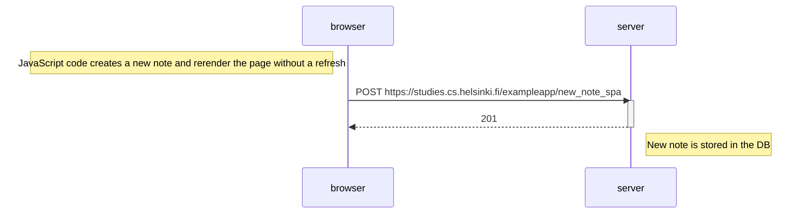

```mermaid
sequenceDiagram
    participant browser
    participant server

    Note left of browser: JavaScript code creates a new note and rerender the page without a refresh

    browser->>server: POST https://studies.cs.helsinki.fi/exampleapp/new_note_spa
    activate server
    server-->>browser: 201
    deactivate server

    Note right of server: New note is stored in the DB
```